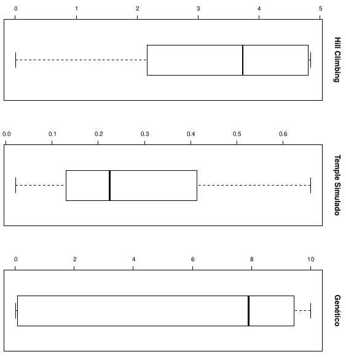
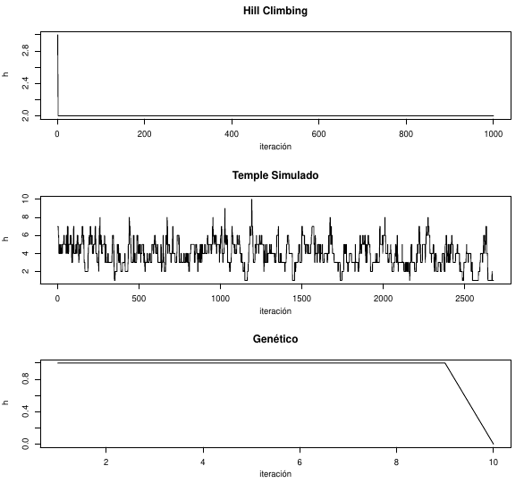

# Ejercicios de búsqueda local.

## Parte I

### Heuristica utilizada

H = cantidad de pares de reinas que se atacan.
Una solución se considera buena cuando *H = 0*.

## Parte II

### Tablas

#### Tiempo de ejecución

|Algoritmo      |Tablero|Soluciones encontradas|Tiempo promedio|Desviación estándar|
|---------------|-------|-------------------|---------------|----------------------|
|Hill climbing  |8      |1                  |0.00648        |*NA*                  |
|Temple simulado|8      |30                 |0.149          |0.0487                |
|Temple Simulado|10     |29                 |0.380          |0.179                 |
|Genético       |8      |13                 |0.344          |1.15                  |
|Genético       |10     |4                  |0.0376         |0.0311                |

#### Estados previos

*Nota: El hill climbing de 10 reinas no aparece porque no encontró ninguna solución*

|Algoritmo|Tablero|Media de pasos|Desviación estándar|
|---------|-------|--------------|-------------------|
|Hill climbing|8|2|NA|
|Temple simulado|8|2940.2333|1677.4332|
|Temple simulado|10|5770.9655|2719.0759|
|Genético|8|43.4615|147.4029|
|Genético|10|3.25|3.3040|

### Gráficos

Ambos gráficos son generables corriendo el script "*calculos.r*". Los dibujos se guardan en archivos pdf.

#### Cajas y bigotes

#### Variación de h

### Preguntas

#### Ejercicio C

En mi opinión el mejor es el algoritmo genético. A pesar de que, en mi caso, el temple simulado haya funcionado mejor, el genético encuentra las soluciones en menos pasos. Es muy probable que si se ajustaran algunos parámetros del primero, como el tamaño de la población o el nuevo número de individuos, funcionaría mejor que el simulated annealing.

### Link del TP

https://docs.google.com/document/d/1Ocz9ZmOkIiVV7kgDguH99cpOWDKuxoKF6hwgtIv_NNQ/edit